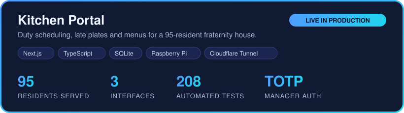
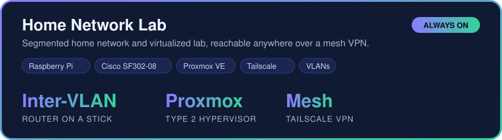

Focused on <b>network security</b>, <b>self-hosted infrastructure</b>, 
and <b>software real people depend on every day</b>.

&nbsp;
&nbsp;

  

## Featured work

## Languages

## Frameworks & Databases

## Infrastructure & Systems

## Security Toolkit

 

  

**Right now:** studying for Security+ · Hack The Box workshops with Ethical Hackers of Purdue · SARMA representative for Purdue FSCL

 

